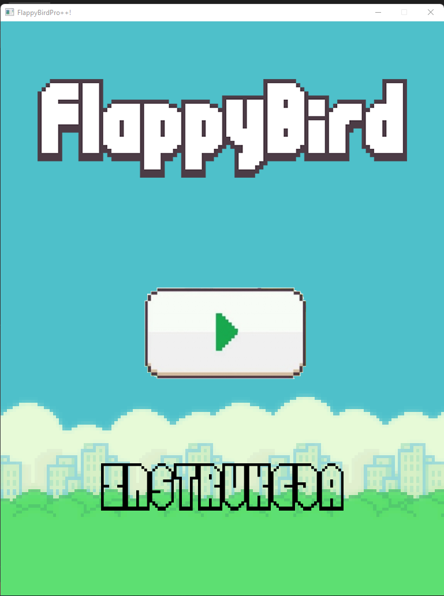
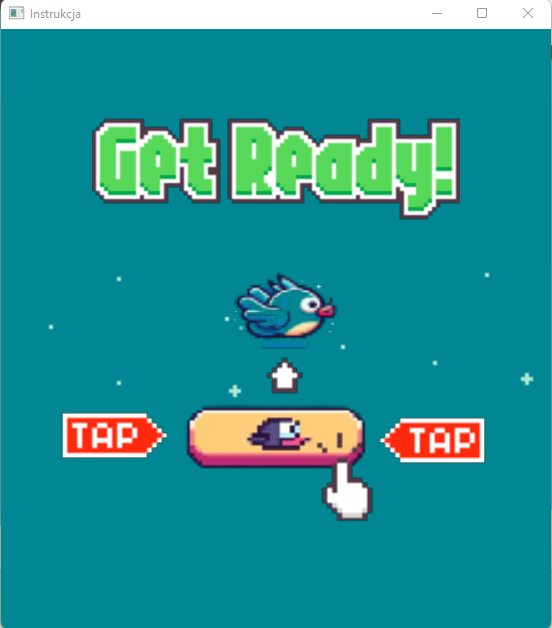
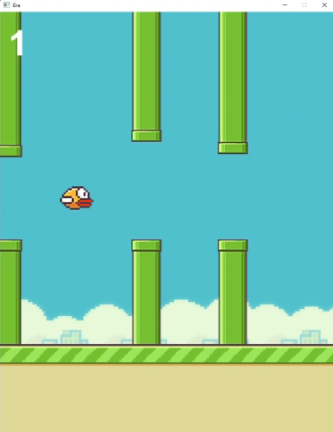

# FlappyBird


## Opis

Flappy Bird to prosta gra 2D, w której gracz kontroluje ptaka, próbującego przelecieć przez rząd rur zielonych bez ich dotykania.


## Instalacja

Aby zainstalować grę Flappy Bird, sklonuj to repozytorium na swoim lokalnym komputerze.

```bash
git clone https://github.com/weronikamazurczak/FlappyBird.git
```

## Jak Grać
Gracz może sterować ptakiem, naciskając klawisz spacja. Celem gry jest unikanie zderzenia z rurami poprzez sterowanie ptakiem. Jeśli ptak dotknie rury lub spadnie, gra się kończy.


## Zrzuty ekranu

Poniżej znajdują się zrzuty ekranu z gry:








